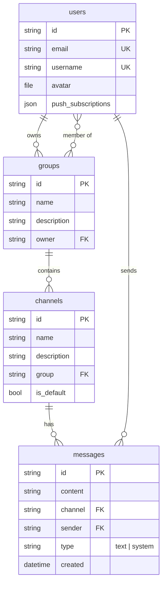
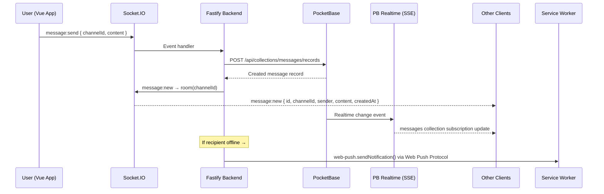
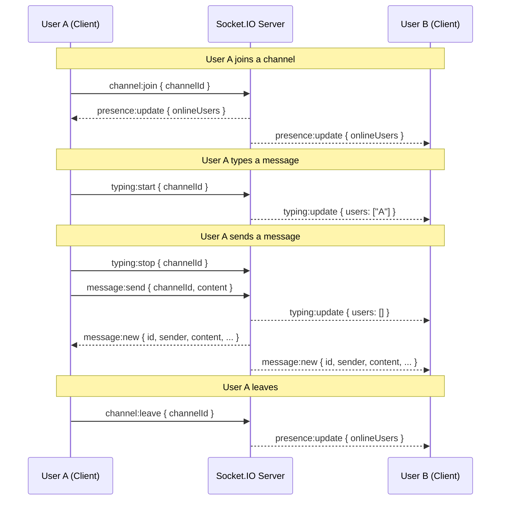
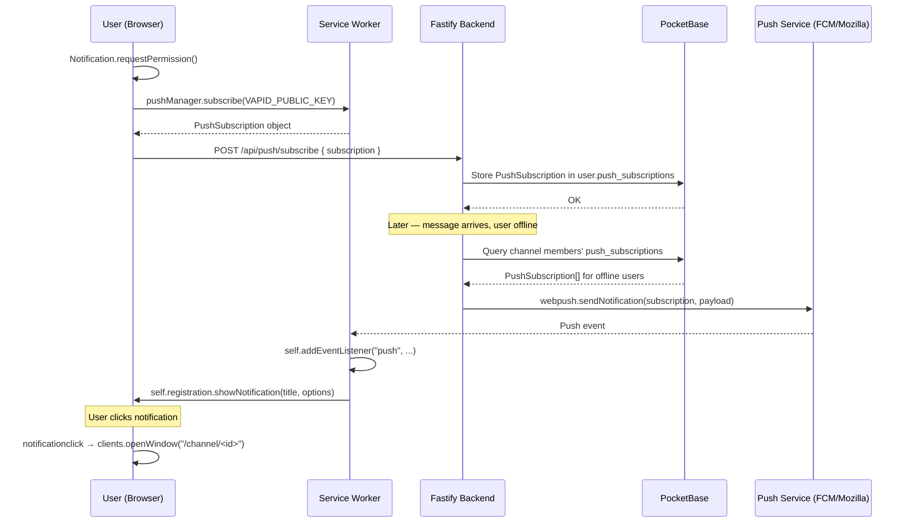
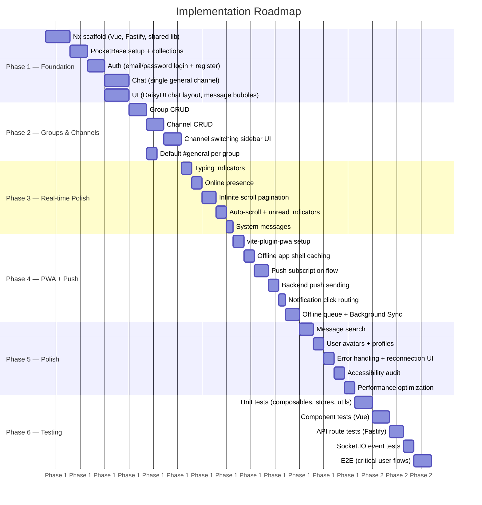
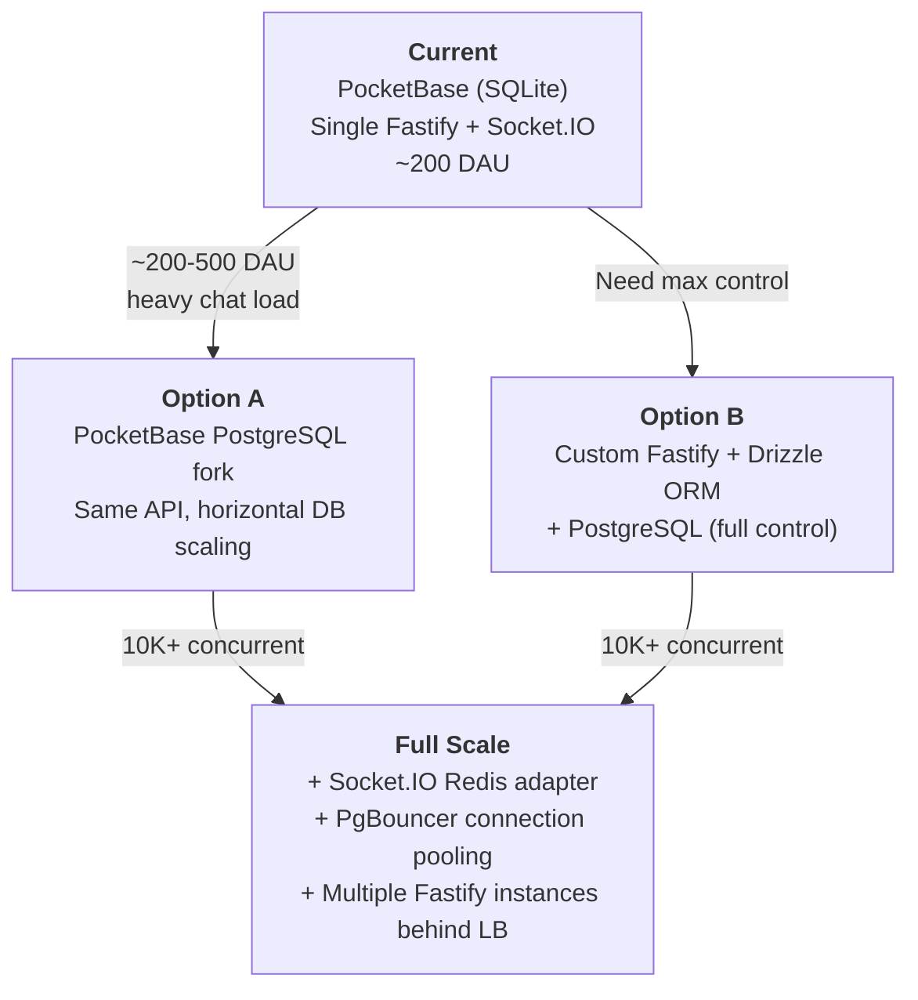

# Chat PWA — Architecture Document

> **Real-time group chat Progressive Web App with Slack-style Groups → Channels.**
> This is a living reference document — keep it updated as the architecture evolves.

---

## Table of Contents

- [1. Tech Stack](#1-tech-stack)
- [2. Project Structure](#2-project-structure)
- [3. Data Model](#3-data-model)
- [4. Real-Time Architecture](#4-real-time-architecture)
- [5. Socket.IO Events Contract](#5-socketio-events-contract)
- [6. Authentication](#6-authentication)
- [7. Push Notifications](#7-push-notifications)
- [8. PWA Capabilities](#8-pwa-capabilities)
- [9. Implementation Phases](#9-implementation-phases)
- [10. Scaling Path](#10-scaling-path)

---

## 1. Tech Stack

| Layer | Technology | Rationale |
|---|---|---|
| **Frontend** | Vue 3 (Composition API) + TypeScript | Reactive, composable architecture; first-class TS support; lightweight runtime |
| **UI Framework** | DaisyUI (Tailwind CSS) | Pre-built accessible components on top of Tailwind; chat-friendly UI primitives; easy theming |
| **Backend** | Fastify + TypeScript | High-performance HTTP framework; first-class plugin system; schema-based validation; excellent TS DX |
| **Database** | PocketBase (SQLite) | Single-binary deploy; built-in auth, realtime SSE, file storage; zero-config for MVP |
| **Real-time (ephemeral)** | Socket.IO | Bi-directional WebSocket transport for typing indicators, presence, instant message relay |
| **Real-time (data sync)** | PocketBase Realtime (SSE) | Server-Sent Events for authoritative data change subscriptions; keeps client stores in sync |
| **Push Notifications** | `web-push` (W3C Web Push API + VAPID) | Zero infrastructure cost; direct push to browser endpoints via standard Web Push Protocol; VAPID authentication; simple ~50 lines of integration; scales to Azure Notification Hub later if needed |
| **PWA Tooling** | vite-plugin-pwa (`injectManifest` strategy) | Full control over service worker; Workbox precaching + custom push handler |
| **Monorepo** | Nx + pnpm workspaces | Task orchestration, caching, dependency graph, code generation; pnpm for fast, disk-efficient installs |
| **Auth** | PocketBase email/password | Built-in auth collection with JWT tokens; no external IdP needed for MVP |

---

## 2. Project Structure

```
chat/
├── apps/
│   ├── frontend/                  # Vue 3 + Vite + DaisyUI PWA
│   │   └── src/
│   │       ├── components/
│   │       │   ├── chat/
│   │       │   │   ├── ChatView.vue          # Main chat view
│   │       │   │   ├── MessageList.vue       # Scrollable message list
│   │       │   │   ├── MessageInput.vue      # Compose & send
│   │       │   │   ├── MessageBubble.vue     # Individual message
│   │       │   │   └── ChannelSidebar.vue    # Channel/group list
│   │       │   └── auth/
│   │       │       ├── LoginForm.vue
│   │       │       └── RegisterForm.vue
│   │       ├── composables/
│   │       │   ├── useChat.ts               # Socket.IO chat logic
│   │       │   ├── useAuth.ts               # Auth state & methods
│   │       │   ├── useChannels.ts           # Channel management
│   │       │   └── usePush.ts               # Push notification subscription
│   │       ├── stores/
│   │       │   ├── chatStore.ts             # Messages, typing indicators
│   │       │   ├── authStore.ts             # User session
│   │       │   └── channelStore.ts          # Groups & channels
│   │       ├── router/
│   │       │   └── index.ts                 # Vue Router with auth guards
│   │       ├── service-worker.ts            # Custom SW (injectManifest)
│   │       └── App.vue
│   │
│   └── backend/                   # Fastify API + Socket.IO
│       └── src/
│           ├── plugins/
│           │   ├── socket.ts               # Socket.IO Fastify plugin
│           │   ├── pocketbase.ts           # PocketBase client plugin
│           │   ├── auth.ts                 # JWT/session auth plugin
│           │   └── push.ts                 # web-push VAPID configuration
│           ├── routes/
│           │   ├── channels.ts             # Channel CRUD
│           │   ├── groups.ts               # Group CRUD
│           │   ├── messages.ts             # Message history
│           │   ├── auth.ts                 # Login/register proxy
│           │   └── push.ts                 # Push subscription management
│           ├── handlers/
│           │   └── chat.ts                 # Socket.IO event handlers
│           └── app.ts
│
├── libs/
│   └── shared/                    # Shared TypeScript types
│       └── src/
│           ├── types/
│           │   ├── message.ts
│           │   ├── channel.ts
│           │   ├── group.ts
│           │   ├── user.ts
│           │   └── events.ts              # Socket event contracts
│           └── index.ts
│
├── pocketbase/                    # PocketBase binary + data
│   ├── pb_data/
│   └── pb_migrations/
│
└── docs/
    └── ARCHITECTURE.md            # ← You are here
```

---

## 3. Data Model

### 3.1 Collections

| Collection | Type | Description |
|---|---|---|
| `users` | Built-in auth | PocketBase auth collection with email/password |
| `groups` | Custom | Slack-style workspace/team container |
| `channels` | Custom | Conversation channel within a group |
| `messages` | Custom | Individual chat messages |

### 3.2 Schema Detail

```
users (built-in auth collection)
├── email        (string, unique, required)
├── username     (string, unique, required)
├── avatar       (file)
└── push_subscriptions (json) — array of Web Push subscription objects

groups
├── name         (string, required)
├── description  (string)
├── owner        (relation → users, single)
└── members      (relation → users, multiple)

channels
├── name         (string, e.g. "general")
├── group        (relation → groups, single, required)
├── description  (string)
└── is_default   (bool, default: false)

messages
├── content      (string, required)
├── channel      (relation → channels, single, required)
├── sender       (relation → users, single, required)
└── type         (select: text | system)
```

### 3.3 ER Diagram



### 3.4 Key Relationships

- A **User** owns zero or more **Groups** and is a member of zero or more **Groups**.
- A **Group** contains one or more **Channels** (always at least a default `#general`).
- A **Channel** contains zero or more **Messages**.
- A **Message** belongs to exactly one **Channel** and one **User** (sender).

---

## 4. Real-Time Architecture

The system uses a **dual real-time strategy** to separate concerns:

| Concern | Transport | Why |
|---|---|---|
| **Ephemeral events** (typing, presence, instant relay) | Socket.IO (WebSocket) | Bi-directional, low-latency, no persistence needed |
| **Data sync** (message CRUD, channel updates) | PocketBase Realtime (SSE) | Authoritative data changes; keeps client stores consistent |
| **Push notifications** (offline users) | web-push (W3C Web Push API) | Direct push from Fastify to browser push endpoints; no external service needed |

### 4.1 System Architecture Diagram

```mermaid
graph TB
    subgraph Client ["Frontend (Vue 3 PWA)"]
        VUE[Vue 3 App]
        SIO_C[Socket.IO Client]
        PB_SDK[PocketBase JS SDK]
        SW[Service Worker]
    end

    subgraph Server ["Backend (Fastify)"]
        FASTIFY[Fastify Server]
        SIO_S[Socket.IO Server]
        WP[web-push library]
        PB_C[PocketBase Client]
    end

    subgraph DB ["Database (PocketBase)"]
        PB[PocketBase Server]
        SQLITE[(SQLite)]
        SSE[Realtime SSE Engine]
    end

    VUE --> SIO_C
    VUE --> PB_SDK

    SIO_C <-->|"WebSocket (bidir)"| SIO_S
    PB_SDK <-->|"HTTP (CRUD)"| PB
    PB_SDK <--|"SSE (data sync)"| SSE

    SIO_S --> FASTIFY
    FASTIFY --> PB_C
    PB_C <-->|"HTTP (CRUD)"| PB
    PB --> SQLITE
    PB --> SSE

    WP -->|"Web Push Protocol"| SW
    SW -.->|"Notification"| VUE
```

### 4.2 ASCII Reference Diagram

```
Frontend (Vue 3 PWA)          Backend (Fastify)              Database (PocketBase)
┌─────────────────┐          ┌─────────────────┐           ┌─────────────────┐
│                 │ Socket.IO│                 │  HTTP     │                 │
│  Socket.IO      │◄────────►│  Socket.IO      │◄─────────►│  Collections    │
│  Client         │  bidir   │  Server         │  CRUD     │  (users,groups, │
│                 │          │                 │           │   channels,msgs)│
│  PocketBase     │  SSE     │                 │           │                 │
│  JS SDK         │◄─────────┤                 │           │  Realtime SSE   │
│  (subscribe)    │  (data)  │  web-push lib   │           │  (data changes) │
│                 │          │  (VAPID +       │           │                 │
│  Service Worker │◄─ ─ ─ ─ ─│  Web Push       │           │                 │
│  (push + cache) │  Web Push│  Protocol)      │           │                 │
└─────────────────┘          └─────────────────┘           └─────────────────┘
```

### 4.3 Message Flow



---

## 5. Socket.IO Events Contract

### 5.1 Client → Server

| Event | Payload | Description |
|---|---|---|
| `message:send` | `{ channelId: string, content: string }` | Send a new message to a channel |
| `typing:start` | `{ channelId: string }` | User started typing |
| `typing:stop` | `{ channelId: string }` | User stopped typing |
| `channel:join` | `{ channelId: string }` | Join a channel room (subscribe to events) |
| `channel:leave` | `{ channelId: string }` | Leave a channel room (unsubscribe) |

### 5.2 Server → Client

| Event | Payload | Description |
|---|---|---|
| `message:new` | `{ id: string, channelId: string, sender: User, content: string, createdAt: string }` | New message broadcast to channel |
| `typing:update` | `{ channelId: string, users: string[] }` | Currently typing users in channel |
| `presence:update` | `{ channelId: string, onlineUsers: string[] }` | Online users in channel |
| `channel:updated` | `{ channel: Channel }` | Channel metadata changed |

### 5.3 Event Flow Diagram



### 5.4 Room Strategy

- Each channel maps to a Socket.IO room: `channel:<channelId>`
- When a user calls `channel:join`, the server adds them to the room
- Broadcasts (`message:new`, `typing:update`, `presence:update`) are scoped to the channel room
- Presence is tracked per-room via Socket.IO adapter

---

## 6. Authentication

| Aspect | Detail |
|---|---|
| **Provider** | PocketBase built-in auth collection |
| **Method** | Email + password |
| **Token** | PocketBase JWT (stored in `authStore`) |
| **Frontend** | PocketBase JS SDK manages token refresh; Pinia `authStore` wraps state |
| **Backend** | Fastify auth plugin validates PocketBase JWT on HTTP routes |
| **Socket.IO** | Token sent during handshake (`auth: { token }`) and validated in middleware |
| **Route Guards** | Vue Router `beforeEach` guard redirects unauthenticated users to `/login` |

---

## 7. Push Notifications

### 7.1 Overview

Push notifications use the **`web-push`** npm package to send directly to browser push endpoints using **VAPID** authentication. The frontend subscribes via the standard W3C Push API, sends the `PushSubscription` to Fastify, which stores it in PocketBase. When a user is offline, Fastify calls `webpush.sendNotification()` to deliver payloads through browser push services (FCM, Mozilla Push, etc.) — no external notification service required.

If native mobile support or tag-based fan-out at scale is needed later, Azure Notification Hub can be added as a drop-in replacement.

### 7.2 Subscription Flow



### 7.3 ASCII Reference

```
1. User grants notification permission
2. Service worker calls pushManager.subscribe(VAPID_PUBLIC_KEY)
3. Frontend sends PushSubscription to Fastify backend
4. Backend stores PushSubscription object in PocketBase (user's push_subscriptions field)
5. When message arrives + recipient NOT connected via Socket.IO:
   → Fastify queries PocketBase for channel members' subscriptions
   → Filters out users with active Socket.IO connections
   → Calls webpush.sendNotification(subscription, payload) for each remaining
   → Push service (FCM/Mozilla) delivers to browser
6. Service worker receives push event → shows OS notification
7. User clicks notification → app opens to correct channel
```

### 7.4 Backend Push Logic

The backend determines whether to send a push notification by checking if the recipient has an **active Socket.IO connection** in the relevant channel room. If they are not connected:

1. Query PocketBase for all members of the channel
2. Filter out users who currently have an active Socket.IO connection in the channel room
3. For each remaining offline user, retrieve their stored `PushSubscription` objects
4. Call `webpush.sendNotification(subscription, payload)` for each subscription
5. Handle 410 (Gone) responses by removing expired subscriptions from PocketBase

---

## 8. PWA Capabilities

### 8.1 Service Worker Strategy

| Strategy | Scope | Details |
|---|---|---|
| **Precaching** (Workbox) | App shell (HTML, CSS, JS, assets) | Injected at build time via `injectManifest`; versioned by content hash |
| **Runtime cache** (Network-first) | Chat history API calls | Serve from network; fall back to cache for offline viewing |
| **Custom handler** | Push events | `service-worker.ts` handles `push` and `notificationclick` events |

### 8.2 Offline Support

```
┌─────────────────────────────────────────────────┐
│                  OFFLINE MODE                    │
├─────────────────────────────────────────────────┤
│                                                 │
│  App Shell (precached)                          │
│  ├── HTML, CSS, JS, images → Workbox precache   │
│  └── Always available offline                   │
│                                                 │
│  Chat History (runtime cache)                   │
│  ├── Network-first strategy                     │
│  └── Cached responses served when offline       │
│                                                 │
│  Outgoing Messages (IndexedDB queue)            │
│  ├── Messages queued locally when offline        │
│  ├── Background Sync API flushes on reconnect   │
│  └── UI shows "pending" state on queued msgs    │
│                                                 │
└─────────────────────────────────────────────────┘
```

### 8.3 Installability

- **Web App Manifest**: icons (192×192, 512×512), `theme_color`, `background_color`, `display: standalone`
- **Install Prompt**: `beforeinstallprompt` event captured for custom install UI (DaisyUI banner/button)
- **iOS**: `apple-touch-icon` and `apple-mobile-web-app-capable` meta tags

### 8.4 `injectManifest` Configuration

The `vite-plugin-pwa` plugin is configured with the `injectManifest` strategy, which gives full control over the service worker. The custom `service-worker.ts` file:

1. Imports Workbox precaching utilities
2. Calls `precacheAndRoute(self.__WB_MANIFEST)` for app shell
3. Registers runtime routes for API caching
4. Handles `push` events to display notifications
5. Handles `notificationclick` events to navigate to the correct channel

---

## 9. Implementation Phases

### 9.1 Roadmap Diagram



### 9.2 Phase Detail

#### Phase 1 — Foundation (MVP)

| Task | Description |
|---|---|
| Scaffold | Nx generators for Vue 3 app, Fastify app, shared TypeScript library |
| PocketBase | Download binary, configure collections (`users`, `groups`, `channels`, `messages`) |
| Auth | Email/password registration and login via PocketBase SDK; Pinia auth store |
| Chat | Single hardcoded "general" channel; send and receive messages via Socket.IO |
| UI | DaisyUI `chat` component; responsive layout with message bubbles and input |

**Exit Criteria**: User can register, log in, send a message, and see it appear in real time.

#### Phase 2 — Groups & Channels

| Task | Description |
|---|---|
| Group CRUD | Create groups, invite members, manage membership |
| Channel CRUD | Create channels within groups; list channels |
| Sidebar UI | `ChannelSidebar.vue` with group/channel tree navigation |
| Default channel | Every new group auto-creates a `#general` channel (`is_default: true`) |

**Exit Criteria**: Users can create groups, add channels, and switch between them.

#### Phase 3 — Real-time Polish

| Task | Description |
|---|---|
| Typing indicators | `typing:start`/`typing:stop` events; "User is typing…" UI |
| Presence | Track online users per channel; display avatars/badges |
| Pagination | Cursor-based message history; infinite scroll with `MessageList.vue` |
| Auto-scroll | Scroll to bottom on new message; "N new messages" banner when scrolled up |
| System messages | `type: "system"` messages for join/leave events |

**Exit Criteria**: Chat feels alive — typing dots, online indicators, smooth scrolling.

#### Phase 4 — PWA + Push

| Task | Description |
|---|---|
| PWA setup | `vite-plugin-pwa` with `injectManifest`; web app manifest with icons |
| Offline shell | Workbox precaching for HTML/CSS/JS; network-first for API |
| Push subscribe | Permission prompt; `pushManager.subscribe()`; store PushSubscription in PocketBase via Fastify |
| Push send | Backend detects offline users; sends notification directly via `web-push` npm package |
| Click routing | `notificationclick` handler opens app at `/channel/<id>` |
| Offline queue | IndexedDB message queue; Background Sync API flush on reconnect |

**Exit Criteria**: App installable; push notifications work; basic offline support.

#### Phase 5 — Polish & Quality

| Task | Description |
|---|---|
| Search | Full-text message search (PocketBase filter or SQLite FTS5) |
| Avatars | Upload, display, fallback to initials |
| Error handling | Reconnection UI; toast notifications for errors; retry logic |
| Accessibility | ARIA labels, keyboard navigation, screen reader testing |
| Performance | Lazy loading, virtual scrolling for large message lists, bundle analysis |

**Exit Criteria**: Production-quality UX; accessible; performant.

#### Phase 6 — Testing

| Layer | Scope | Tools |
|---|---|---|
| Unit | Composables, Pinia stores, utility functions | Vitest |
| Component | Vue components in isolation | Vitest + Vue Test Utils |
| API | Fastify route handlers | Vitest + `fastify.inject()` |
| Socket.IO | Event handlers, room logic | Vitest + `socket.io-client` (mock) |
| E2E | Critical user flows (register → chat → push) | Playwright |

**Exit Criteria**: Comprehensive test coverage; all CI checks pass.

---

## 10. Scaling Path

### 10.1 Current Architecture (MVP)

```
Single Server
├── PocketBase (SQLite, single binary)
├── Fastify + Socket.IO (single process)
└── Suitable for: ~100-200 concurrent users
```

### 10.2 Scaling Stages



### 10.3 Scaling Decision Table

| Trigger | Action | Complexity |
|---|---|---|
| SQLite write contention | Migrate to PocketBase PostgreSQL fork | Low — API stays the same |
| Need custom queries / advanced ORM | Move to Fastify + Drizzle ORM + PostgreSQL | Medium — rewrite data layer |
| Multiple server instances needed | Add Socket.IO Redis adapter for shared state | Medium — infra change |
| High DB connection count | Add PgBouncer for connection pooling | Low — infra-only |
| Global distribution needed | Add CDN for static assets; regional Fastify instances | High — architecture change |

### 10.4 What Stays the Same

Regardless of scaling stage, these remain constant:

- **Frontend**: Vue 3 PWA (no changes needed)
- **Socket.IO event contract**: Same events, same payloads
- **Push notifications**: web-push direct sends; migrate to Azure Notification Hub if adding native mobile or needing tag-based fan-out at scale
- **Service worker**: Same caching and push handling logic

---

## Appendix

### A. Environment Variables

| Variable | Description | Used By |
|---|---|---|
| `POCKETBASE_URL` | PocketBase server URL (e.g., `http://127.0.0.1:8090`) | Backend, Frontend |
| `VAPID_PUBLIC_KEY` | VAPID public key for browser push subscription | Frontend, Backend |
| `VAPID_PRIVATE_KEY` | VAPID private key for web-push signing | Backend |
| `VAPID_SUBJECT` | VAPID subject (e.g., `mailto:admin@example.com`) | Backend |
| `SOCKET_IO_PATH` | Socket.IO endpoint path (default: `/socket.io`) | Backend, Frontend |
| `PORT` | Fastify server port | Backend |

### B. Key Dependencies

| Package | Version Policy | Purpose |
|---|---|---|
| `vue` | `^3.x` | Frontend framework |
| `pinia` | `^2.x` | State management |
| `vue-router` | `^4.x` | Client-side routing |
| `socket.io` | `^4.x` | Server-side WebSocket |
| `socket.io-client` | `^4.x` | Client-side WebSocket |
| `pocketbase` | `^0.x` | PocketBase JS SDK |
| `fastify` | `^5.x` | HTTP server |
| `web-push` | `^3.x` | W3C Web Push Protocol with VAPID authentication |
| `vite-plugin-pwa` | `^0.x` | PWA build integration |
| `workbox-precaching` | `^7.x` | Service worker precaching |
| `daisyui` | `^4.x` | UI component library |
| `tailwindcss` | `^3.x` | Utility-first CSS |

### C. Naming Conventions

| Entity | Convention | Example |
|---|---|---|
| PocketBase collections | `snake_case` (plural) | `messages`, `push_subscriptions` |
| TypeScript types | `PascalCase` | `Message`, `Channel`, `SocketEvents` |
| Vue components | `PascalCase` | `MessageBubble.vue`, `ChatView.vue` |
| Composables | `camelCase` with `use` prefix | `useChat`, `useAuth` |
| Pinia stores | `camelCase` with `Store` suffix | `chatStore`, `authStore` |
| Socket.IO events | `noun:verb` | `message:send`, `typing:start` |
| API routes | `kebab-case` (REST) | `/api/groups/:id/channels` |

---

*Last updated: 2026-03-19*
