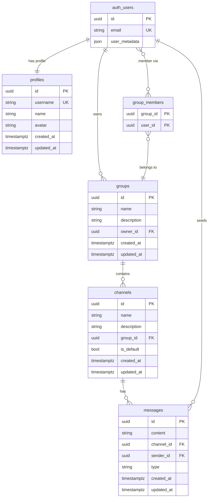
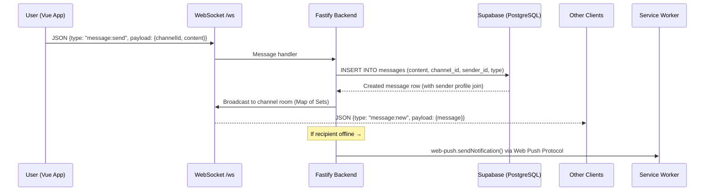
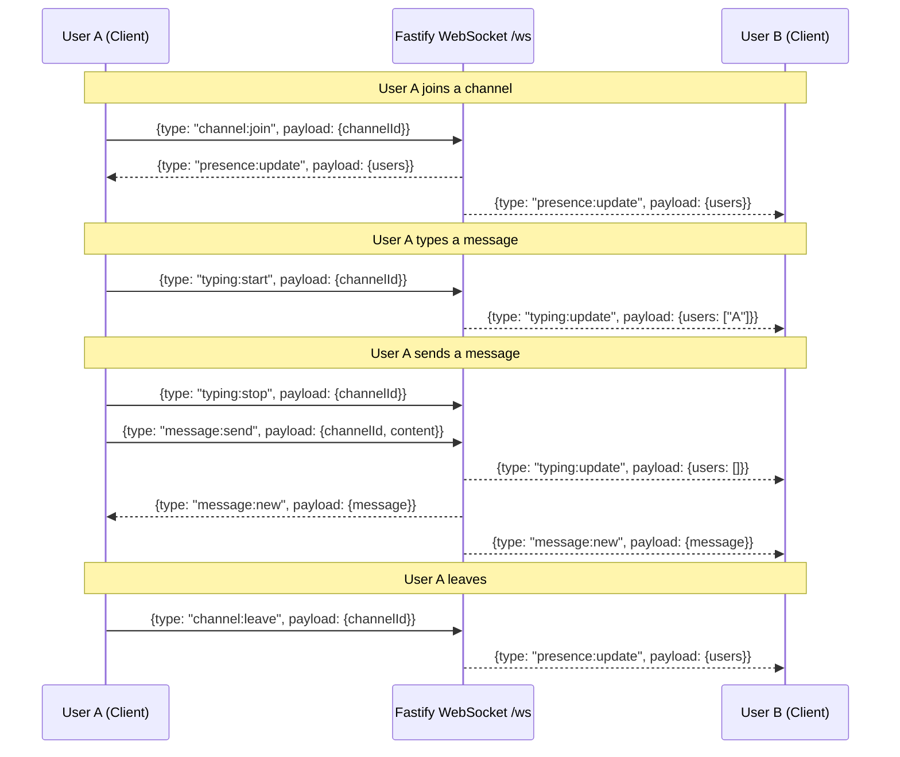
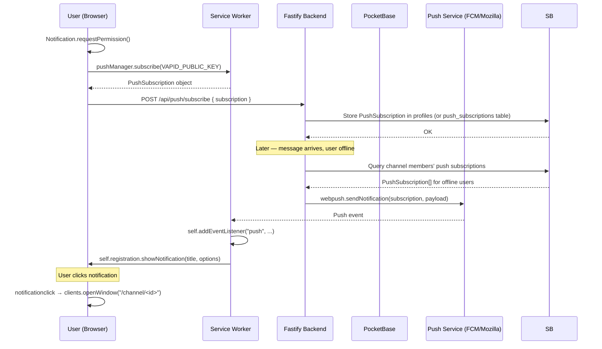
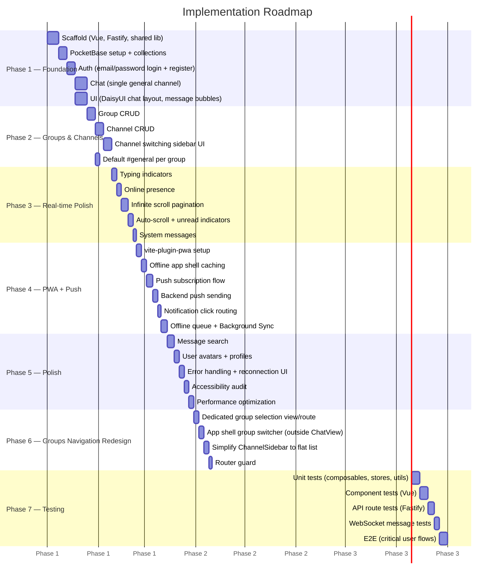
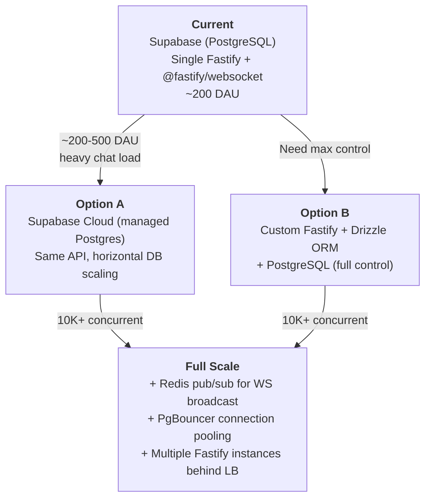

# Chat PWA — Architecture Document

> **Real-time group chat Progressive Web App with Slack-style Groups → Channels.**
> This is a living reference document — keep it updated as the architecture evolves.

---

## Table of Contents

- [1. Tech Stack](#1-tech-stack)
- [2. Project Structure](#2-project-structure)
- [3. Data Model](#3-data-model)
- [4. Real-Time Architecture](#4-real-time-architecture)
- [5. WebSocket Message Contract](#5-websocket-message-contract)
- [6. Authentication](#6-authentication)
- [7. Push Notifications](#7-push-notifications)
- [8. PWA Capabilities](#8-pwa-capabilities)
- [9. Implementation Phases](#9-implementation-phases)
- [10. Scaling Path](#10-scaling-path)

---

## 1. Tech Stack

| Layer                     | Technology                                  | Rationale                                                                                                                                                                                          |
| ------------------------- | ------------------------------------------- | -------------------------------------------------------------------------------------------------------------------------------------------------------------------------------------------------- |
| **Frontend**              | Vue 3 (Composition API) + TypeScript        | Reactive, composable architecture; first-class TS support; lightweight runtime                                                                                                                     |
| **UI Framework**          | DaisyUI (Tailwind CSS)                      | Pre-built accessible components on top of Tailwind; chat-friendly UI primitives; easy theming                                                                                                      |
| **Backend**               | Fastify + TypeScript                        | High-performance HTTP framework; first-class plugin system; schema-based validation; excellent TS DX                                                                                               |
| **Database**              | Supabase (PostgreSQL)                       | Managed Postgres with built-in auth, row-level security, real-time, and storage; local dev via Supabase CLI + Docker                                                                               |
| **Real-time (ephemeral)** | @fastify/websocket (native WebSocket)       | Bi-directional WebSocket transport for typing indicators, presence, instant message relay; JSON messages with discriminated unions                                                                 |
| **Push Notifications**    | `web-push` (W3C Web Push API + VAPID)       | Zero infrastructure cost; direct push to browser endpoints via standard Web Push Protocol; VAPID authentication; simple ~50 lines of integration; scales to Azure Notification Hub later if needed |
| **PWA Tooling**           | vite-plugin-pwa (`injectManifest` strategy) | Full control over service worker; Workbox precaching + custom push handler                                                                                                                         |
| **Monorepo**              | pnpm workspaces                             | Workspace dependency management; fast, disk-efficient installs; run tasks via `pnpm --filter`                                                                                                      |
| **Auth**                  | Supabase Auth (email/password)              | Built-in email/password auth with JWT tokens; service role key for server-side admin operations; frontend uses anon key only for auth                                                              |

---

## 2. Project Structure

```
chat/
├── apps/
│   ├── frontend/                  # Vue 3 + Vite + DaisyUI PWA
│   │   └── src/
│   │       ├── components/
│   │       │   ├── chat/
│   │       │   │   ├── ChatView.vue          # Main chat view
│   │       │   │   ├── MessageList.vue       # Scrollable message list
│   │       │   │   ├── MessageInput.vue      # Compose & send
│   │       │   │   ├── MessageBubble.vue     # Individual message
│   │       │   │   └── ChannelSidebar.vue    # Channel/group list
│   │       │   └── auth/
│   │       │       ├── LoginForm.vue
│   │       │       └── RegisterForm.vue
│   │       ├── composables/
│   │       │   ├── useChat.ts               # WebSocket chat logic (native browser WebSocket)
│   │       │   ├── useAuth.ts               # Auth state & methods
│   │       │   ├── useChannels.ts           # Channel management
│   │       │   └── usePush.ts               # Push notification subscription
│   │       ├── stores/
│   │       │   ├── chatStore.ts             # Messages, typing indicators
│   │       │   ├── authStore.ts             # User session (Supabase auth only)
│   │       │   └── channelStore.ts          # Groups & channels (via Fastify REST)
│   │       ├── lib/
│   │       │   └── supabase.ts              # Supabase anon client (auth only)
│   │       ├── router/
│   │       │   └── index.ts                 # Vue Router with auth guards
│   │       ├── views/
│   │       │   ├── ChatView.vue              # Main chat view (route-level)
│   │       │   └── GroupsView.vue            # Group selection view (route-level)
│   │       ├── service-worker.ts            # Custom SW (injectManifest)
│   │       └── App.vue
│   │
│   └── backend/                   # Fastify API + @fastify/websocket
│       └── src/
│           ├── plugins/
│           │   ├── socket.ts               # @fastify/websocket plugin (WS route at /ws)
│           │   ├── supabase.ts             # Supabase service role client plugin
│           │   ├── auth.ts                 # Auth plugin (supabase.auth.getUser)
│           │   └── push.ts                 # web-push VAPID configuration
│           ├── routes/
│           │   ├── channels.ts             # Channel CRUD
│           │   ├── groups.ts               # Group CRUD
│           │   ├── auth.ts                 # Login/register endpoints
│           │   └── push.ts                 # Push subscription management
│           ├── handlers/
│           │   └── chat.ts                 # WebSocket message handlers (room management)
│           ├── supabase/
│           │   └── migrations/             # SQL migrations applied via supabase db reset
│           └── app.ts
│
├── libs/
│   └── shared/                    # Shared TypeScript types
│       └── src/
│           ├── types/
│           │   ├── message.ts
│           │   ├── channel.ts
│           │   ├── auth.ts
│           │   └── events.ts              # WebSocket message contracts (discriminated unions)
│           └── index.ts
│
└── docs/
    └── ARCHITECTURE.md            # ← You are here
```

---

## 3. Data Model

### 3.1 Tables

| Table           | Description                                                  |
| --------------- | ------------------------------------------------------------ |
| `auth.users`    | Supabase managed auth table (email, password hash, metadata) |
| `profiles`      | Public user profile (extends `auth.users` via FK)            |
| `groups`        | Slack-style workspace/team container                         |
| `group_members` | Junction table linking users to groups (many-to-many)        |
| `channels`      | Conversation channel within a group                          |
| `messages`      | Individual chat messages                                     |

### 3.2 Schema Detail

```
auth.users (Supabase managed)
├── id           (uuid, PK)
├── email        (string, unique)
└── user_metadata (json) — stores username, name, avatar

profiles (auto-created by trigger on auth.users insert)
├── id           (uuid, PK, FK → auth.users.id CASCADE)
├── username     (text, unique)
├── name         (text)
├── avatar       (text)
├── created_at   (timestamptz)
└── updated_at   (timestamptz)

groups
├── id           (uuid, PK)
├── name         (text, required)
├── description  (text)
├── owner_id     (uuid, FK → auth.users SET NULL)
├── created_at   (timestamptz)
└── updated_at   (timestamptz)

group_members
├── group_id     (uuid, FK → groups CASCADE, PK)
└── user_id      (uuid, FK → auth.users CASCADE, PK)

channels
├── id           (uuid, PK)
├── name         (text, required)
├── group_id     (uuid, FK → groups CASCADE)
├── description  (text)
├── is_default   (bool, default false)
├── created_at   (timestamptz)
└── updated_at   (timestamptz)

messages
├── id           (uuid, PK)
├── content      (text, required)
├── channel_id   (uuid, FK → channels CASCADE)
├── sender_id    (uuid, FK → auth.users CASCADE)
├── type         (text: 'text' | 'system')
├── created_at   (timestamptz)
└── updated_at   (timestamptz)
```

### 3.3 ER Diagram



### 3.4 Key Relationships

- A **User** owns zero or more **Groups** and joins them via the **group_members** junction table.
- A **Group** contains one or more **Channels** (always at least a default `#general`, auto-created on group creation).
- A **Channel** contains zero or more **Messages**.
- A **Message** belongs to exactly one **Channel** and one **User** (sender).
- A **Profile** is auto-created by a PostgreSQL trigger on `auth.users` insert.

---

## 4. Real-Time Architecture

The system uses a **dual real-time strategy** to separate concerns:

| Concern                                                | Transport                             | Why                                                                                                |
| ------------------------------------------------------ | ------------------------------------- | -------------------------------------------------------------------------------------------------- |
| **Ephemeral events** (typing, presence, instant relay) | @fastify/websocket (native WebSocket) | Bi-directional, low-latency, no persistence needed; pure WebSocket (no HTTP long-polling fallback) |
| **Data sync** (message CRUD, channel updates)          | PocketBase Realtime (SSE)             | Authoritative data changes; keeps client stores consistent                                         |
| **Push notifications** (offline users)                 | web-push (W3C Web Push API)           | Direct push from Fastify to browser push endpoints; no external service needed                     |

### 4.1 System Architecture Diagram

```mermaid
graph TB
    subgraph Client ["Frontend (Vue 3 PWA)"]
        VUE[Vue 3 App]
        WS_C[Native Browser WebSocket]
        PB_SDK[PocketBase JS SDK]
        SW[Service Worker]
    end

    subgraph Server ["Backend (Fastify)"]
        FASTIFY[Fastify Server]
        WS_S[@fastify/websocket]
        WP[web-push library]
        PB_C[PocketBase Client]
    end

    subgraph DB ["Database (PocketBase)"]
        PB[PocketBase Server]
        SQLITE[(SQLite)]
        SSE[Realtime SSE Engine]
    end

    VUE --> WS_C
    VUE --> PB_SDK

    WS_C <-->|"WebSocket /ws (bidir JSON)"| WS_S
    PB_SDK <-->|"HTTP (CRUD)"| PB
    PB_SDK <--|"SSE (data sync)"| SSE

    WS_S --> FASTIFY
    FASTIFY --> PB_C
    PB_C <-->|"HTTP (CRUD)"| PB
    PB --> SQLITE
    PB --> SSE

    WP -->|"Web Push Protocol"| SW
    SW -.->|"Notification"| VUE
```

### 4.2 ASCII Reference Diagram

```
Frontend (Vue 3 PWA)          Backend (Fastify)              Database (PocketBase)
┌─────────────────┐          ┌─────────────────┐           ┌─────────────────┐
│                 │WebSocket │                 │  HTTP     │                 │
│  Native Browser │◄────────►│  @fastify/       │◄─────────►│  Collections    │
│  WebSocket      │ /ws bidir│  websocket      │  CRUD     │  (users,groups, │
│                 │ (JSON)   │                 │           │   channels,msgs)│
│  PocketBase     │  SSE     │                 │           │                 │
│  JS SDK         │◄─────────┤                 │           │  Realtime SSE   │
│  (subscribe)    │  (data)  │  web-push lib   │           │  (data changes) │
│                 │          │  (VAPID +       │           │                 │
│  Service Worker │◄─ ─ ─ ─ ─│  Web Push       │           │                 │
│  (push + cache) │  Web Push│  Protocol)      │           │                 │
└─────────────────┘          └─────────────────┘           └─────────────────┘
```

### 4.3 Message Flow



---

## 5. WebSocket Message Contract

All messages are sent as **JSON strings** over the WebSocket connection at `/ws`. Messages use **discriminated unions** with a `type` field for routing and a `payload` field for data. Types are defined in `libs/shared/src/types/events.ts` as `ClientMessage` and `ServerMessage`.

### 5.1 Client → Server (`ClientMessage`)

| `type`          | `payload`                                | Description                               |
| --------------- | ---------------------------------------- | ----------------------------------------- |
| `message:send`  | `{ channelId: string, content: string }` | Send a new message to a channel           |
| `typing:start`  | `{ channelId: string }`                  | User started typing                       |
| `typing:stop`   | `{ channelId: string }`                  | User stopped typing                       |
| `channel:join`  | `{ channelId: string }`                  | Join a channel room (subscribe to events) |
| `channel:leave` | `{ channelId: string }`                  | Leave a channel room (unsubscribe)        |

**Example** (client sends):

```json
{
  "type": "message:send",
  "payload": { "channelId": "abc123", "content": "Hello!" }
}
```

### 5.2 Server → Client (`ServerMessage`)

| `type`            | `payload`                                                    | Description                       |
| ----------------- | ------------------------------------------------------------ | --------------------------------- |
| `message:new`     | `{ message: MessageWithSender }`                             | New message broadcast to channel  |
| `typing:update`   | `{ channelId: string, users: string[] }`                     | Currently typing users in channel |
| `presence:update` | `{ channelId: string, users: string[] }`                     | Online users in channel           |
| `channel:updated` | `{ channelId: string, name?: string, description?: string }` | Channel metadata changed          |

**Example** (server sends):

```json
{ "type": "message:new", "payload": { "message": { "id": "...", "content": "Hello!", ... } } }
```

### 5.3 Event Flow Diagram



### 5.4 Room Strategy

- Each channel maps to a room managed via `Map<string, Set<WebSocket>>` in `handlers/chat.ts`
- When a client sends `channel:join`, the server adds their WebSocket to the channel's `Set`
- Broadcasts (`message:new`, `typing:update`, `presence:update`) iterate the channel's `Set` and send to each open WebSocket
- Presence and typing state are tracked per-channel using in-memory `Map` structures
- On disconnect, the server cleans up all room memberships and presence state for that WebSocket

---

## 6. Authentication

| Aspect           | Detail                                                                                                                             |
| ---------------- | ---------------------------------------------------------------------------------------------------------------------------------- |
| **Provider**     | Supabase Auth (email/password)                                                                                                     |
| **Method**       | Email + password                                                                                                                   |
| **Token**        | Supabase JWT (`session.access_token`) stored in Pinia `authStore`                                                                  |
| **Frontend**     | Supabase JS SDK (`signUp`, `signInWithPassword`, `signOut`, `getSession`, `onAuthStateChange`) — used **only for auth**            |
| **Backend**      | `supabase.auth.getUser(token)` called on every authenticated request; no manual JWT parsing                                        |
| **WebSocket**    | JWT token sent as query parameter (`/ws?token=JWT`) and validated via `supabase.auth.getUser(token)` during WebSocket upgrade      |
| **Route Guards** | Vue Router `beforeEach` guard redirects unauthenticated users to `/login`                                                          |
| **Data access**  | All data operations (groups, channels, messages) go through the Fastify REST API — the frontend never queries Supabase DB directly |

---

## 7. Push Notifications

### 7.1 Overview

Push notifications use the **`web-push`** npm package to send directly to browser push endpoints using **VAPID** authentication. The frontend subscribes via the standard W3C Push API, sends the `PushSubscription` to Fastify, which stores it in PocketBase. When a user is offline, Fastify calls `webpush.sendNotification()` to deliver payloads through browser push services (FCM, Mozilla Push, etc.) — no external notification service required.

If native mobile support or tag-based fan-out at scale is needed later, Azure Notification Hub can be added as a drop-in replacement.

### 7.2 Subscription Flow



### 7.3 ASCII Reference

```
1. User grants notification permission
2. Service worker calls pushManager.subscribe(VAPID_PUBLIC_KEY)
3. Frontend sends PushSubscription to Fastify backend
4. Backend stores PushSubscription object in Supabase (profiles or a push_subscriptions table)
5. When message arrives + recipient NOT connected via WebSocket:
   → Fastify queries Supabase for channel members' subscriptions
   → Filters out users with active WebSocket connections
   → Calls webpush.sendNotification(subscription, payload) for each remaining
   → Push service (FCM/Mozilla) delivers to browser
6. Service worker receives push event → shows OS notification
7. User clicks notification → app opens to correct channel
```

### 7.4 Backend Push Logic

The backend determines whether to send a push notification by checking if the recipient has an **active WebSocket connection** in the relevant channel room. If they are not connected:

1. Query PocketBase for all members of the channel
2. Filter out users who currently have an active WebSocket connection in the channel room
3. For each remaining offline user, retrieve their stored `PushSubscription` objects
4. Call `webpush.sendNotification(subscription, payload)` for each subscription
5. Handle 410 (Gone) responses by removing expired subscriptions from Supabase

---

## 8. PWA Capabilities

### 8.1 Service Worker Strategy

| Strategy                          | Scope                             | Details                                                                |
| --------------------------------- | --------------------------------- | ---------------------------------------------------------------------- |
| **Precaching** (Workbox)          | App shell (HTML, CSS, JS, assets) | Injected at build time via `injectManifest`; versioned by content hash |
| **Runtime cache** (Network-first) | Chat history API calls            | Serve from network; fall back to cache for offline viewing             |
| **Custom handler**                | Push events                       | `service-worker.ts` handles `push` and `notificationclick` events      |

### 8.2 Offline Support

```
┌─────────────────────────────────────────────────┐
│                  OFFLINE MODE                    │
├─────────────────────────────────────────────────┤
│                                                 │
│  App Shell (precached)                          │
│  ├── HTML, CSS, JS, images → Workbox precache   │
│  └── Always available offline                   │
│                                                 │
│  Chat History (runtime cache)                   │
│  ├── Network-first strategy                     │
│  └── Cached responses served when offline       │
│                                                 │
│  Outgoing Messages (IndexedDB queue)            │
│  ├── Messages queued locally when offline        │
│  ├── Background Sync API flushes on reconnect   │
│  └── UI shows "pending" state on queued msgs    │
│                                                 │
└─────────────────────────────────────────────────┘
```

### 8.3 Installability

- **Web App Manifest**: icons (192×192, 512×512), `theme_color`, `background_color`, `display: standalone`
- **Install Prompt**: `beforeinstallprompt` event captured for custom install UI (DaisyUI banner/button)
- **iOS**: `apple-touch-icon` and `apple-mobile-web-app-capable` meta tags

### 8.4 `injectManifest` Configuration

The `vite-plugin-pwa` plugin is configured with the `injectManifest` strategy, which gives full control over the service worker. The custom `service-worker.ts` file:

1. Imports Workbox precaching utilities
2. Calls `precacheAndRoute(self.__WB_MANIFEST)` for app shell
3. Registers runtime routes for API caching
4. Handles `push` events to display notifications
5. Handles `notificationclick` events to navigate to the correct channel

---

## 9. Implementation Phases

### 9.1 Roadmap Diagram



### 9.2 Phase Detail

| Phase 1 — Foundation (MVP)

| Task     | Description                                                                   |
| -------- | ----------------------------------------------------------------------------- |
| Scaffold | Vue 3 app, Fastify app, shared TypeScript library                             |
| Supabase | Start local Supabase CLI stack; apply migrations (`supabase db reset`)        |
| Auth     | Email/password registration and login via Supabase Auth SDK; Pinia auth store |
| Chat     | Single hardcoded "general" channel; send and receive messages via WebSocket   |
| UI       | DaisyUI `chat` component; responsive layout with message bubbles and input    |

**Exit Criteria**: User can register, log in, send a message, and see it appear in real time.

#### Phase 2 — Groups & Channels

| Task            | Description                                                            |
| --------------- | ---------------------------------------------------------------------- |
| Group CRUD      | Create groups, invite members, manage membership                       |
| Channel CRUD    | Create channels within groups; list channels                           |
| Sidebar UI      | `ChannelSidebar.vue` with group/channel tree navigation                |
| Default channel | Every new group auto-creates a `#general` channel (`is_default: true`) |

**Exit Criteria**: Users can create groups, add channels, and switch between them.

#### Phase 3 — Real-time Polish

| Task              | Description                                                               |
| ----------------- | ------------------------------------------------------------------------- |
| Typing indicators | `typing:start`/`typing:stop` events; "User is typing…" UI                 |
| Presence          | Track online users per channel; display avatars/badges                    |
| Pagination        | Cursor-based message history; infinite scroll with `MessageList.vue`      |
| Auto-scroll       | Scroll to bottom on new message; "N new messages" banner when scrolled up |
| System messages   | `type: "system"` messages for join/leave events                           |

**Exit Criteria**: Chat feels alive — typing dots, online indicators, smooth scrolling.

#### Phase 4 — PWA + Push

| Task           | Description                                                                                    |
| -------------- | ---------------------------------------------------------------------------------------------- |
| PWA setup      | `vite-plugin-pwa` with `injectManifest`; web app manifest with icons                           |
| Offline shell  | Workbox precaching for HTML/CSS/JS; network-first for API                                      |
| Push subscribe | Permission prompt; `pushManager.subscribe()`; store PushSubscription in PocketBase via Fastify |
| Push send      | Backend detects offline users; sends notification directly via `web-push` npm package          |
| Click routing  | `notificationclick` handler opens app at `/channel/<id>`                                       |
| Offline queue  | IndexedDB message queue; Background Sync API flush on reconnect                                |

**Exit Criteria**: App installable; push notifications work; basic offline support.

#### Phase 5 — Polish & Quality

| Task           | Description                                                              |
| -------------- | ------------------------------------------------------------------------ |
| Search         | Full-text message search (PostgreSQL `tsvector` / `ilike`)               |
| Avatars        | Upload, display, fallback to initials                                    |
| Error handling | Reconnection UI; toast notifications for errors; retry logic             |
| Accessibility  | ARIA labels, keyboard navigation, screen reader testing                  |
| Performance    | Lazy loading, virtual scrolling for large message lists, bundle analysis |

**Exit Criteria**: Production-quality UX; accessible; performant.

#### Phase 6 — Groups Navigation Redesign

| Task                    | Description                                                                                                                                   |
| ----------------------- | --------------------------------------------------------------------------------------------------------------------------------------------- |
| Group selection view    | Dedicated `GroupsView.vue` route for browsing and selecting a group; replaces in-chat group switching                                         |
| App shell integration   | Group switcher lives outside `ChatView` (e.g. top-level nav or landing page); entering `ChatView` implies an active group is already selected |
| Simplify ChannelSidebar | Remove group-switching collapsibles; `ChannelSidebar` becomes a flat channel list for the active group only                                   |
| Router guard            | Navigation to `ChatView` requires an active group context (`channelStore.activeGroup`); redirects to group selection view if none is set      |

**Exit Criteria**: Group selection is fully external to `ChatView`; `ChannelSidebar` renders a flat channel list with no group collapsibles; the current bug where collapsibles stay open showing "Add Channel"/"Add Member" without an active group is eliminated.

#### Phase 7 — Testing

| Layer     | Scope                                        | Tools                            |
| --------- | -------------------------------------------- | -------------------------------- |
| Unit      | Composables, Pinia stores, utility functions | Vitest                           |
| Component | Vue components in isolation                  | Vitest + Vue Test Utils          |
| API       | Fastify route handlers                       | Vitest + `fastify.inject()`      |
| WebSocket | Message handlers, room logic                 | Vitest + native WebSocket (mock) |
| E2E       | Critical user flows (register → chat → push) | Playwright                       |

**Exit Criteria**: Comprehensive test coverage; all CI checks pass.

---

## 10. Scaling Path

### 10.1 Current Architecture (MVP)

```
Single Server
├── Supabase (PostgreSQL, local or cloud)
├── Fastify + @fastify/websocket (single process)
└── Suitable for: ~100-200 concurrent users
```

### 10.2 Scaling Stages



### 10.3 Scaling Decision Table

| Trigger                            | Action                                                   | Complexity                  |
| ---------------------------------- | -------------------------------------------------------- | --------------------------- |
| High DB connection count           | Add PgBouncer for connection pooling                     | Low — infra-only            |
| Multiple server instances needed   | Add Redis pub/sub for cross-instance WebSocket broadcast | Medium — infra change       |
| Need advanced ORM / custom queries | Add Drizzle ORM layer over the existing Supabase DB      | Medium — rewrite data layer |
| Global distribution needed         | Add CDN for static assets; regional Fastify instances    | High — architecture change  |

### 10.4 What Stays the Same

Regardless of scaling stage, these remain constant:

- **Frontend**: Vue 3 PWA (no changes needed)
- **WebSocket message contract**: Same message types, same payloads
- **Push notifications**: web-push direct sends; migrate to Azure Notification Hub if adding native mobile or needing tag-based fan-out at scale
- **Service worker**: Same caching and push handling logic

---

## Appendix

### A. Environment Variables

| Variable                    | Description                                                                                            | Used By           |
| --------------------------- | ------------------------------------------------------------------------------------------------------ | ----------------- |
| `SUPABASE_URL`              | Supabase project URL (e.g., `http://localhost:54321`)                                                  | Backend           |
| `SUPABASE_SERVICE_ROLE_KEY` | Service role key — bypasses RLS; never expose to browser                                               | Backend           |
| `SUPABASE_ANON_KEY`         | Anon key — used by backend for sign-in session creation                                                | Backend           |
| `VITE_SUPABASE_URL`         | Supabase URL exposed to Vite frontend (auth only)                                                      | Frontend          |
| `VITE_SUPABASE_ANON_KEY`    | Anon key exposed to Vite frontend (auth only)                                                          | Frontend          |
| `VAPID_PUBLIC_KEY`          | VAPID public key for browser push subscription                                                         | Frontend, Backend |
| `VAPID_PRIVATE_KEY`         | VAPID private key for web-push signing                                                                 | Backend           |
| `VAPID_SUBJECT`             | VAPID subject (e.g., `mailto:admin@example.com`)                                                       | Backend           |
| `VITE_WS_URL`               | WebSocket base URL (e.g., `http://localhost:3000`); frontend converts to `ws://` and connects to `/ws` | Frontend          |
| `PORT`                      | Fastify server port                                                                                    | Backend           |

### B. Key Dependencies

| Package                 | Version Policy | Purpose                                                     |
| ----------------------- | -------------- | ----------------------------------------------------------- |
| `vue`                   | `^3.x`         | Frontend framework                                          |
| `pinia`                 | `^2.x`         | State management                                            |
| `vue-router`            | `^4.x`         | Client-side routing                                         |
| `@fastify/websocket`    | `^11.x`        | Fastify WebSocket plugin (wraps `ws`)                       |
| _(native WebSocket)_    | —              | Browser-native WebSocket API (no client library)            |
| `@supabase/supabase-js` | `^2.x`         | Supabase JS SDK (auth on frontend; admin client on backend) |
| `fastify`               | `^5.x`         | HTTP server                                                 |
| `web-push`              | `^3.x`         | W3C Web Push Protocol with VAPID authentication             |
| `vite-plugin-pwa`       | `^0.x`         | PWA build integration                                       |
| `workbox-precaching`    | `^7.x`         | Service worker precaching                                   |
| `daisyui`               | `^4.x`         | UI component library                                        |
| `tailwindcss`           | `^3.x`         | Utility-first CSS                                           |

### C. Naming Conventions

| Entity                  | Convention                      | Example                                                |
| ----------------------- | ------------------------------- | ------------------------------------------------------ |
| Supabase tables         | `snake_case` (plural)           | `messages`, `group_members`, `profiles`                |
| TypeScript types        | `PascalCase`                    | `Message`, `Channel`, `ClientMessage`, `ServerMessage` |
| Vue components          | `PascalCase`                    | `MessageBubble.vue`, `ChatView.vue`                    |
| Composables             | `camelCase` with `use` prefix   | `useChat`, `useAuth`                                   |
| Pinia stores            | `camelCase` with `Store` suffix | `chatStore`, `authStore`                               |
| WebSocket message types | `noun:verb`                     | `message:send`, `typing:start`                         |
| API routes              | `kebab-case` (REST)             | `/api/groups/:id/channels`                             |

---

_Last updated: 2026-03-24_
